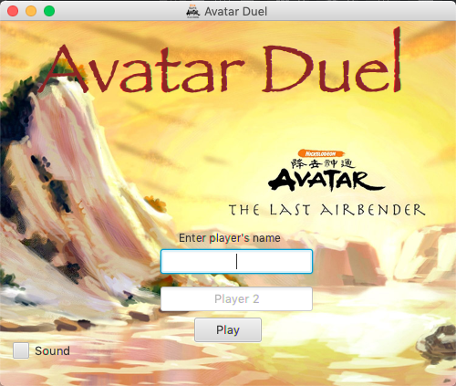
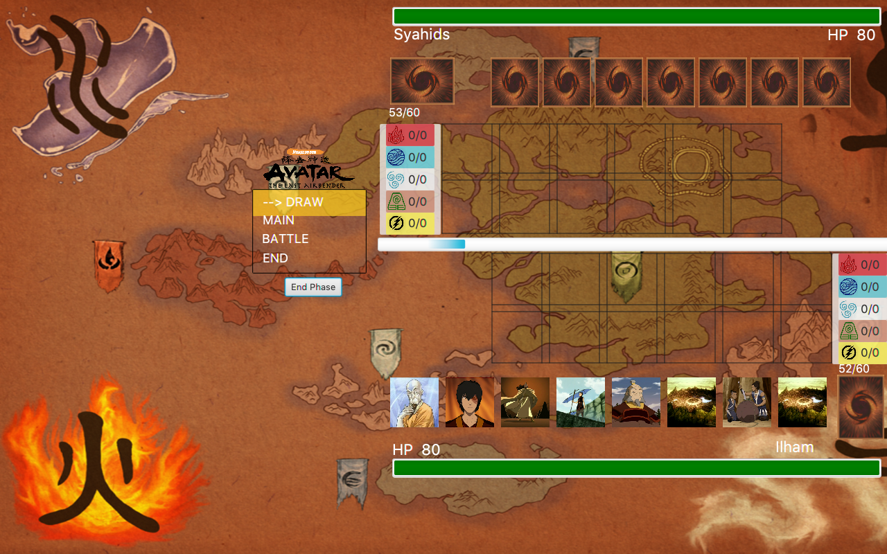
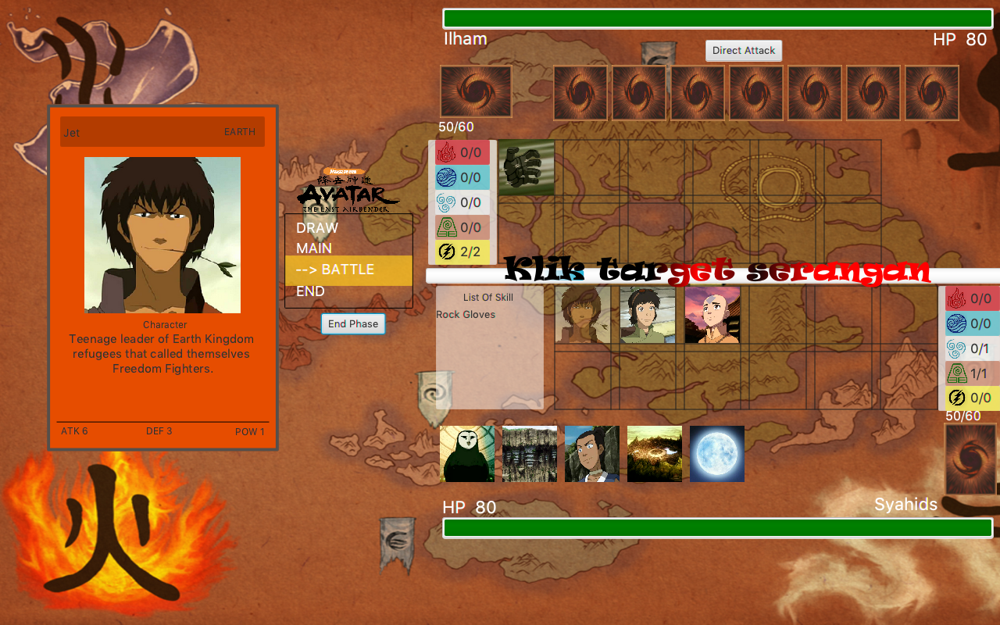

# IF2210 Project Template

Compile and run with these commands:

`./gradlew run`

## Struktur Kode
Aplikasi ini memanfaatkan tiga buah package, yaitu:
- model : package untuk implementasi model-model kelas pada program
- util : package untuk implementasi utilisasi program
- view : package untuk mengimplementasikan tampilan atau GUI aplikasi

Aplikasi ini terbagi atas tiga buah folder, yaitu:
- src : folder yang berisi source code dari package dan main program
- src/main : folder yang berisi kelas-kelas program
- src/test : folder yang berisi unit testing

## Screenshot

### Register View

### Launching View

### Battle View

## Credit

All images and description are taken from [Avatar Wikia](https://avatar.fandom.com/wiki/Avatar_Wiki)
